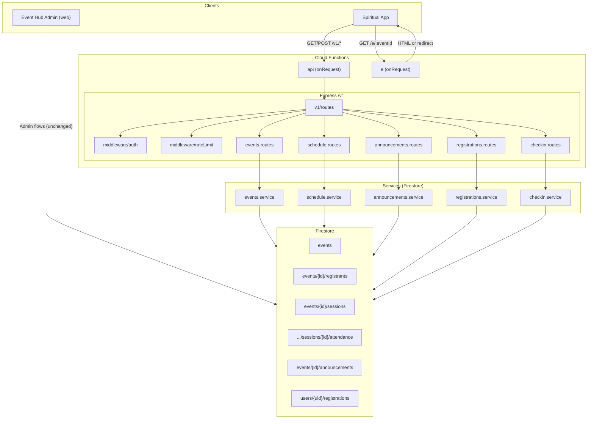

# Events Hub API — Architecture Summary

## High-level flow

```
┌─────────────────┐     HTTPS      ┌──────────────────────────────────────────┐
│  Spiritual App  │ ◄─────────────► │  Cloud Functions (HTTP)                  │
│  (mobile/web)   │  Bearer token  │    api  → Express app → /v1/*            │
└─────────────────┘                │    e   → Deep link GET /e/:eventId      │
         │                          └─────────────────┬──────────────────────┘
         │                                            │
         │                                            ▼
         │                          ┌──────────────────────────────────────────┐
         └─────────────────────────►│  Firestore (event-hub-dev / event-hub-prod) │
            (same DB for Admin UI)  │    events, registrants, sessions,         │
                                    │    attendance, announcements, users/*    │
                                    └──────────────────────────────────────────┘
```

## Component diagram (Mermaid)



## Request path (member)

1. **Client** sends request with `Authorization: Bearer <idToken>`.
2. **Cloud Function** `api` invokes the Express app.
3. **Middleware** `requireAuth` verifies the token with Firebase Auth and sets `req.user`.
4. **Route** calls the appropriate handler (e.g. `registrations.routes.register`).
5. **Service** (e.g. `registrations.service`) runs business logic and uses **Firestore** (transactions, reads, writes).
6. **Response** is JSON: `{ ok: true, data }` or `{ ok: false, error: { code, message } }`.

## Data flow (Firestore)

| API surface        | Firestore usage |
|--------------------|------------------|
| Events list/detail | `events` collection, optional filters |
| Sessions           | `events/{eventId}/sessions` |
| Announcements      | `events/{eventId}/announcements` |
| Register           | `events/{eventId}/registrants`, `users/{uid}/registrations/{eventId}` (mirror) |
| Check-in main      | `events/{eventId}/registrants/{uid}` (eventAttendance.checkedInAt) |
| Check-in session   | `events/{eventId}/sessions/{sessionId}/attendance/{uid}` + registrant doc |
| My registrations   | `users/{uid}/registrations` (mirror) or registrants by uid |

Existing Event Hub admin and check-in flows use the same Firestore paths; the API adds the mirror `users/{uid}/registrations` for app registrations and uses `registrantId = uid` for app-created registrants.

## Security

- **Public:** No token; visibility enforced in event queries.
- **Member:** Valid Firebase ID token required; `req.user.uid` used for register and check-in.
- **Rate limit:** Check-in endpoints are rate-limited per user per event per minute (in-memory in the function).

## Deployment

- **Functions:** `firebase deploy --only functions` (or `npm run deploy` in `functions/`, which runs tests then build then deploy).
- **API URL:** `https://<region>-<project>.cloudfunctions.net/api` → `/v1/*`.
- **Deep link URL:** `https://<region>-<project>.cloudfunctions.net/e/<eventId>`.

---

*See [README.md](./README.md) and [openapi.yaml](./openapi.yaml) for endpoint details.*
